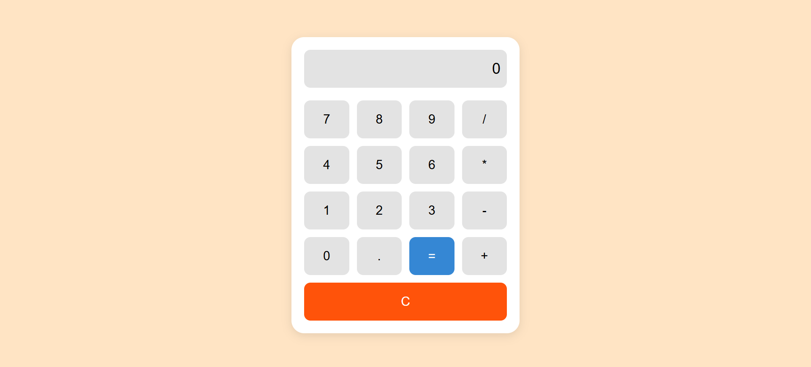

# 🧮 Calculator Web Application - Task 02 (Alternative)

A simple, user-friendly calculator web app built using **HTML**, **CSS**, and **JavaScript**, styled with **Bootstrap 5** for a clean and responsive layout. This calculator performs basic arithmetic operations and is optimized for both desktop and mobile use.

---

## 🔥 Features

- ➕ Addition, ➖ Subtraction, ✖️ Multiplication, ➗ Division  
- Responsive layout using Bootstrap Grid  
- Clean and intuitive user interface  
- Real-time display updates  
- Minimal, beginner-friendly JavaScript logic  
- Error handling for invalid inputs

---

## 🚀 Live Demo

👉 [Try it here](https://vel-calculator.netlify.app)

---

## 🛠️ Tech Stack

- 🌐 HTML5  
- 🎨 CSS3 & Bootstrap 5  
- ⚙️ JavaScript (Vanilla)

---

## 📸 Screenshot



---

## 🧑‍💻 How to Run Locally

1. Clone this repository:
   ```bash
   git clone https://github.com/Snehasich/SCT_WD_2.git

2. Navigate to the folder:
   ```bash
   cd calculator-app

3. Open index.html in your browser:
   ```bash
   start index.html
